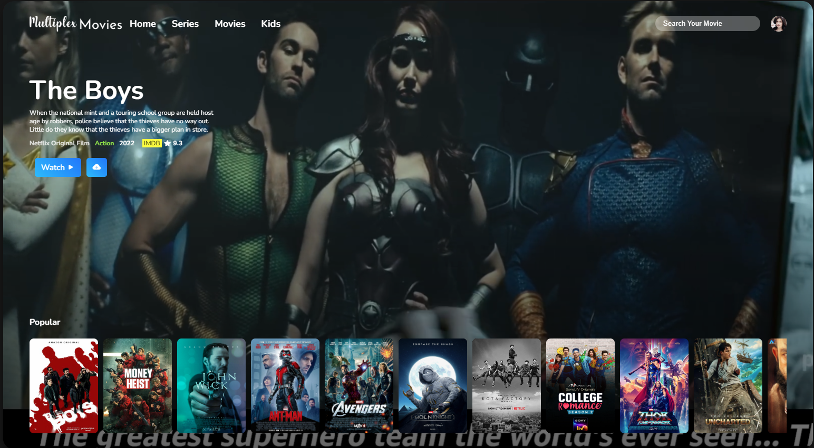

# 🎬 Movie Home Page

A responsive Movie Home Page created using HTML, CSS, and JavaScript. This project showcases a modern and clean design, optimized for various screen sizes, and aims to provide users with an engaging and intuitive browsing experience.

## 🌟 Features

- **Responsive Design:** Seamlessly adapts to different screen sizes and devices, ensuring a consistent user experience across desktops, tablets, and mobile phones.
- **Interactive Elements:** JavaScript is used to create dynamic interactions, enhancing the overall user engagement.
- **Modern Aesthetics:** Clean and modern UI design with a focus on user-friendliness and visual appeal.
- **Optimized Performance:** Efficient code structure with minimal loading times, providing a smooth and responsive interface.

## 🖼️ Screenshots

### Home Page

## 🛠️ Technologies Used

- **HTML5:** For structuring the content and layout of the web page.
- **CSS3:** For styling, animations, and responsive design elements.
- **JavaScript:** For adding interactivity and dynamic functionality.
